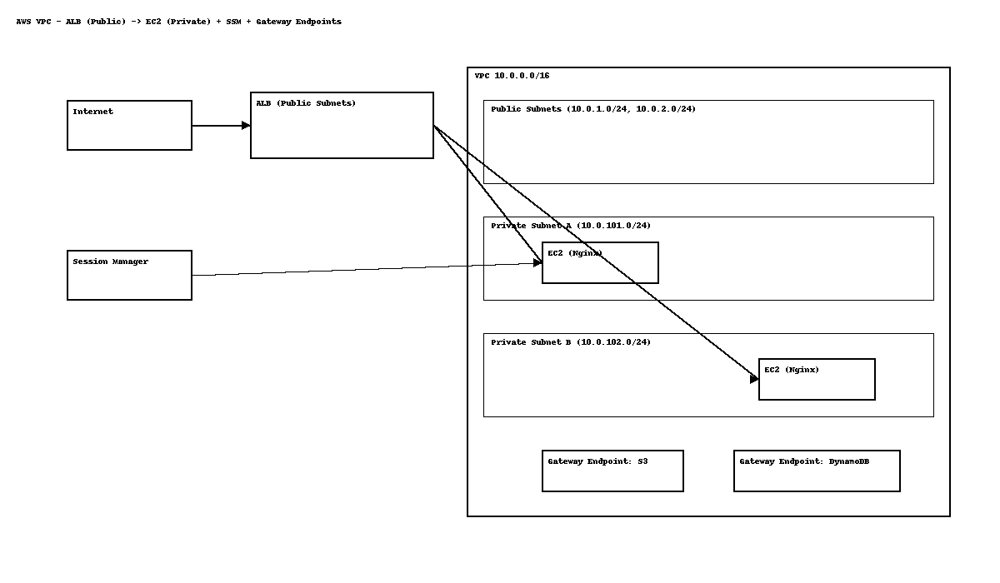

# VPC + ALB  (public) + (Private) EC2, S3/DDB Gateway Endpoint, (SSM, No Public IPs)

A secure, cost-aware AWS networking project: **public Application Load Balancer** routes traffic to **private EC2 instances** (no public IPs) in multiple AZs. Access to instances is via **AWS Systems Manager Session Manager** — no bastion host or SSH keys. Private subnets reach AWS services using **Gateway VPC Endpoints** (S3 + DynamoDB) so you can avoid a NAT Gateway.

##  Why this is portfolio-worthy
- **Secure by design:** Instances have *no* public IPs. Inbound traffic terminates at the ALB; admin access via SSM only.
- **Cost optimization:** Gateway Endpoints replace a NAT Gateway for S3/DynamoDB access.
- **Highly available:** Public + private subnets across two AZs; ALB + Auto Scaling Group.

##  Architecture Components
- **VPC:** 10.0.0.0/16; 2 public subnets (10.0.1.0/24, 10.0.2.0/24), 2 private subnets (10.0.101.0/24, 10.0.102.0/24)
- **Internet Gateway** attached to VPC
- **Application Load Balancer (ALB)** in public subnets (HTTP :80)
- **EC2 Auto Scaling Group** in private subnets running Nginx
- **SSM Session Manager** for shell access (no keys)
- **Gateway VPC Endpoints:** S3 + DynamoDB
- **Security Groups:** ALB open on :80; EC2 only allows :80 **from ALB SG**

##  What I verified
- Browser → **ALB DNS** → Target Group → **private EC2** returned the Nginx page.
- Target Group health checks passed.
- Session Manager shell access worked without SSH.

##  Reproduce (Console Runbook)
See **[`docs/runbook.md`](docs/runbook.md)** for the click-by-click console guide (VPC + subnets, IGW, routes, SGs, launch template + ASG, target group + ALB, endpoints, and verification).

##  Suggested screenshots for the repo/LinkedIn
Place images under `docs/screenshots/`:
- `alb-success.png` – Browser showing the Nginx page via the ALB DNS name.
- `target-group-healthy.png` – Target group with healthy targets.
- `ssm-session.png` – Session Manager shell open on an instance.

##  Diagram
- Edit `docs/architecture.drawio` in draw.io (File → Open from device).
- Export as **PNG** and overwrite `docs/architecture.png` in this repo.

##  LinkedIn blurb
See [`portfolio-post.md`](portfolio-post.md) for a copy-ready LinkedIn post.

##  Cleanup
Terminate ASG → delete ALB & target group → delete endpoints → detach/delete IGW → delete subnets/route tables → delete VPC → delete IAM role if only for this demo.

##  Screenshots

**ALB success page**  

**Target Group health check**  

**SSM Session Manager**  

---

**Author:** Cliffton C. Benford  
**Date:** 2025-08-29
